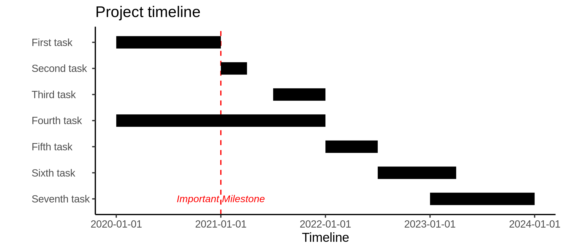

## Simple Gantt chart in R

A simple template for creating a Gantt chart using ggplot2 in R. It's designed to make editing the timeline and labels easy via csv files. There's tons of ways to customize this that are beyond the scope of what I have time to put here.

#### Code

``` R
library("ggplot2")
library("tidyr")

# Timeline data
timeline = read.csv("timeline.csv", stringsAsFactors = FALSE)
timeline$name = factor(timeline$name, levels = rev(timeline$name)) # Preserve the order of the steps in the csv

timeline = pivot_longer(timeline, cols = start:end, names_to = "time") # Needed modification for ggplot

# Where the x-axis labels should be placed and what they should say
labels <- read.csv("labels.csv", stringsAsFactors = FALSE)

# Plot
ggplot(timeline, aes(value, name)) +
  geom_vline(xintercept = 1, linetype = "dashed", colour = "red") + # How to add vertical line for important dates/milestones
  geom_line(size = 5) +
  annotate("text", x = c(1), y = c(1),
           label = c("Important Milestone"),
           fontface = 3, size = 3, color = "red") + # Annotations for one or more items. In this case, it's for the vertical line
  labs(x = "Timeline", y = NULL, title = "Project timeline") +
  scale_x_continuous(breaks = labels$x, labels = labels$lab) +
  theme_classic() +
  theme(axis.text.y = element_text(hjust = 0)) + # Left aligns y-axis labels
  coord_fixed(ratio = 0.25) # Essentially compresses the graph vertically


ggsave("gantt.png", width = 7, height = 3) # Set dimensions to how big the figure should be if printed (default: inches)
  
```

#### Output



#### Notes

The example uses integers to represent years (0 is the beginning, 1 is 1 year in, etc). This is arbitrary; you could choose other things for timeline values. For example, you could treat the x-axis as a percentage where 0 is 0% done and 100 is 100% done. The only catch is that whatever you choose, you will probably have to play around the coord_fixed() ratio argument and output dimensions to get everything looking nice.
